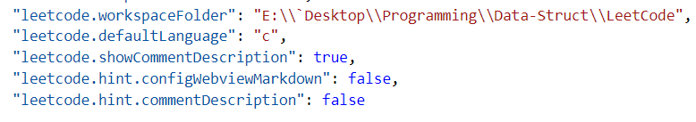

## 刷LeetCode 的好处
### 个人感受
通过看题集，LeetCode 相对于各种 OJ，它没有十分致力于竞赛。
有很多直接用数据结构的术语表述。

### 相对于 其他OJ 的优势
而 LeetCode 较上述 OJ 而言有如下优势:
题基本上都来自于业内大公司的真实面试题
题目不是竞赛性质，难度也适中
支持多种主流编程语言C++/C/C#/Python/Java/js/Ruby/PHP/Kotlin等
不用处理输入输出问题，可以集中精力解决具体问题
提供Discuss环境，可参考他人代码
提供执行用时分布图表，可看到自己提交的代码在所有已AC代码中的运行效率排名

## 选项: VS Code本地Debug + 在 LeetCode 插件中验证和提交
官方参考：[vscode-leetcode](https://github.com/jdneo/vscode-leetcode/blob/master/docs/README_zh-CN.md)
#### Requirements
VS Code 1.30.1+
Node.js 8+
安装插件之后侧边栏就会有新的一个选项
#### Sign in
[LeetCode VSCode fail to sign in](https://jingyan.baidu.com/article/2c8c281d0b9c0d4009252a57.html)

VSCode登录LeetCode默认是外国，需要切换到国内区即可
#### Setting
1. 更新配置项 leetcode.workspaceFolder 来指定保存题目文件所用的工作区路径。默认工作区路径为：$HOME/.leetcode/。
1. 通过更新配置项 leetcode.showCommentDescription 来指定是否要在注释中包含题目描述。
1. 通过 LeetCode: Switch Default Language 命令变更答题时默认使用编程语言。
以下是我目前的设置：

#### Coding
点击一个题目，在右下角有 `Code Now`

## 