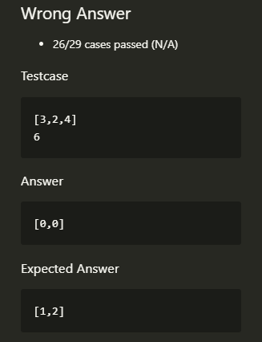
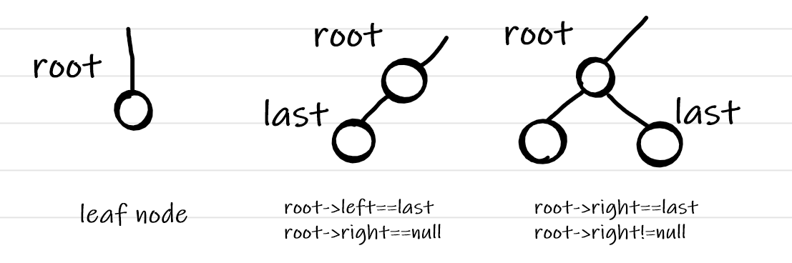
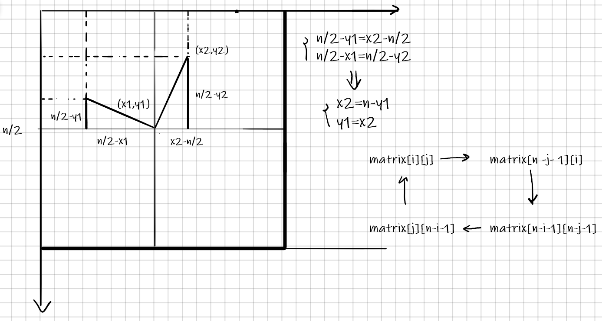
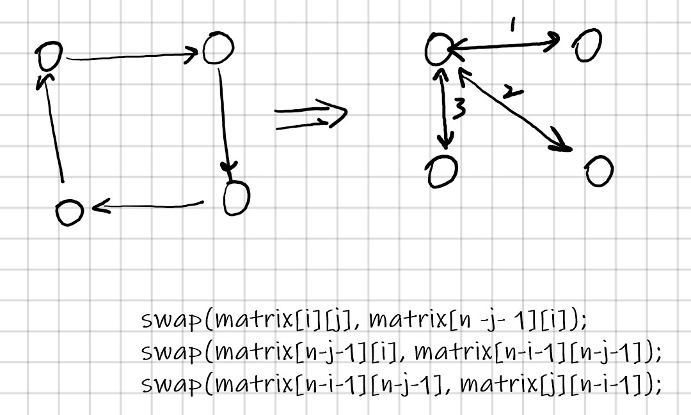
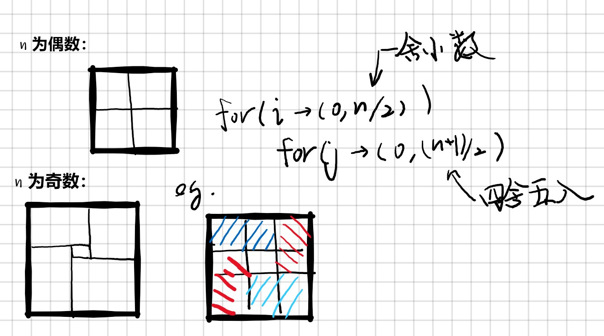

# Error

## 错误提示：load of null pointer of type 'const int'

在调用函数时，如果返回值如果是一个常量则没问题；
如果返回值若为指针则可能会出现该错误，假如返回的指针地址指向函数内的局部变量，在函数退出时，该变量的存储空间会被销毁，此时去访问该地址就会出现这个错误。

解决办法有以下三种:

1. 返回的指针使用 malloc 分配空间（推荐）
1. 将该变量使用 static 修饰 static 修饰的内部变量作用域不变 但是声明周期延长到程序结束 即该变量在函数退出后仍然存在；
1. 使用全局变量（不推荐）

```C
/**
 * Note: The returned array must be malloced, assume caller calls free().
 * 不看题目注释，吃亏在眼前！
 */
int* twoSum(int* nums, int numsSize, int target, int* returnSize){
    int *answer = (int *)malloc(sizeof(int) * 2);
    for(int i = 0; i < numsSize - 1; i++) {
        for(int j = i+1; j < numsSize; j++) {
            if(nums[i]+nums[j] == target) {
                answer[0] = i;
                answer[1] = j;
                *returnSize = 2;
                return answer;
            }
        }
    }
    return answer;
}
```

## error: control may reach end of non-void function [-Werror,-Wreturn-type] }

错误原因：本该返回值的函数未返回值。此时，应该检查一下是否每个控制流都有返回值。

# Write Up

## 1. 两数之和

### 暴力

时间复杂度：$O(n^2)$， 空间复杂度 $O(1)$。

```cpp
class Solution {
public:
    vector<int> twoSum(vector<int>& nums, int target) {
        vector<int> result;
        for(int i = 0; i < nums.size()-1; i++) {
            for(int j = i+1; j < nums.size(); j++) {
                if(nums[i] + nums[j] == target) {
                    result.push_back(i);
                    result.push_back(j);
                    return result;
                }
            }
        }
        return result;
    }
};
```

### 两遍哈希

一种更有效的方法来检查数组中是否存在目标元素。如果存在，我们需要找出它的索引。保持数组中的每个元素与其索引相互对应的最好方法是什么？哈希表。

以空间换取速度。

时间复杂度：$O(n)$， 空间复杂度 $O(n)$。

第一次迭代中，我们将每个元素的值和它的索引添加到表中。

在第二次迭代中，我们将检查每个元素所对应的目标元素  $target - nums[i]$是否存在于表中。:warning: 注意，该目标元素不能是 nums[i] 本身！

没有考虑就会出现：



```cpp
#include <map>
#include <vector>
using namespace std;
class Solution {
public:
    vector<int> result;
    vector<int> twoSum(vector<int>& nums, int target) {
        map<int, int> HashMap;
        // 1. set up HashMap
        for(int i = 0; i < nums.size(); i++) {
            HashMap[nums[i]] = i;
        }
        // 2. find
        for(int i = 0; i < nums.size(); i++) {
            if(HashMap.count(target-nums[i])>0 && i != HashMap[target-nums[i]]) {
                result.push_back(i);
                result.push_back(HashMap[target - nums[i]]);
                return result;
            }
        }
        return result;
    }
};
```

p.s. map 查找不到对应的键的表示方法：

1. find 的返回迭代器为空，注意不是 null。

   map中有一个函数叫 end()，这个函数默认指向 map 中最后一个元素的后一个位置，由此可以理解为空。

   所以，如果非要对 iterator 进行初始化的话，可以将 iterator 指向 end() 函数即可。判断是否为空即与end() 函数做比较即可。

   ```cpp
   map<int, int> Map01;
   map<int, int>::iterator Map_it = Map01.end();
   Map_it.find(num)
   if (it != mymap.end())
       //...
   ```

1. 在 LeetCode 的题解中找到更有趣更简练的方法：

   ```cpp
   map<int, int> Map01;
   if( Map01.count(num) > 0)
       //..
   ```

### 一遍哈希

实证明，我们可以一次完成。在进行迭代并将元素插入到表中的同时，我们还会回过头来检查表中是否已经存在当前元素所对应的目标元素。如果它存在，那我们已经找到了对应解，并立即将其返回。

```cpp
#include <map>
#include <vector>
using namespace std;
class Solution {
public:
    vector<int> twoSum(vector<int>& nums, int target) {
        vector<int> result;
        map<int, int> HashMap;
        for(int i = 0; i < nums.size(); i++) {
            if(HashMap.count(target-nums[i]) > 0) { // 条件少了一个
↑               result.push_back(HashMap[target-nums[i]]);
↓               result.push_back(i); // 注意调换顺序！
                return result;
            }
↕           HashMap[nums[i]] = i;
        }
        return result;
    }
};
```

> 作者：LeetCode
> 链接：https://leetcode-cn.com/problems/two-sum/solution/liang-shu-zhi-he-by-leetcode-2/
> 来源：力扣（LeetCode）
> 著作权归作者所有。商业转载请联系作者获得授权，非商业转载请注明出处。

## 283.移动零.c

思路1

// 1. for, if zero, move

```cpp
void moveZeroes(int* nujs, int numsSize) {
    for(int i = 0; i < numsSize; i++) {
        if(nums[i] == 0) {
            for(int j = i; j < numsSize-1; j++) {
                nums[j] = nums[j+1]；
            }
            nums[numsSize-1] = 0;
        }
    }
}
```

Submit 遇到问题：


<font color="yellow">反思</font>：在脑海里动态地考虑这个问题

如果改成：

```cpp
void moveZeroes(int* nujs, int numsSize) {
    for(int i = 0; i < numsSize; i++) {
        if(nums[i] == 0) {
            for(int j = i; j < numsSize-1; j++) {
                nums[j] = nums[j+1]；
            }
            nums[numsSize-1] = 0;
+           i--;
        }
    }
}
```

遇到连续的 0 就会将进入死循环。

// 不要抢救！换思路！

```cpp
void moveZeroes(int* nums, int numsSize) {
    int num_0 = 0;
    for(int i = 0; i < numsSize; i++) {
        if(nums[i] == 0) {
            num_0++;
        }
    }
    for(int i = 0; i < numsSize; i++) {
        if(num_0 == 0)
            break;
        if(nums[i] == 0) {
            for(int j = i; j < numsSize - 1; j++) {
                nums[j] = nums[j+1];
            }
            i--;
            nums[numsSize-1]=0;
            num_0 --;
        }
    }
}
```


## 26.删除排序数组中的重复项

// 1. for i for j  if == move? 
// 优化：对重复个数进行计数——一次性移动

```Cpp
int removeDuplicates(int* nums, int numsSize)
{
    int time = 0;
    for(int i = 0; i < numsSize - 1; i++) {
        time = 1;   //代表一个元素出现的次数
        for(int j = i+1; j < numsSize; j++) {
            if(nums[i] == nums[j]) {
                time++;
            } else {
                break;
            }
        }
        // time 次出现，需要移动 time-1 格，~~移动次数 = 后面的个数 = numsSize-i-time-1~~
        if(time > 1) {
            // numsSize = xxx + j + time - 1
            for(int j = i+1; j < numsSize-time+1; j++) {
                nums[j] = nums[j+time-1];
            }
        }
        numsSize = numsSize - time + 1;
    }
    return numsSize;
}
```

官方题解：双指针法

```cpp
int removeDuplicates(int* nums, int numsSize)
{
    if (numsSize == 0) return 0;
    int i = 0;
    for(int j = 1; j < numsSize; j++) {
        if(nums[j] != nums[i]) {
            i++;
            nums[i] = nums[j];            
        }
    }
    return (i+1);
}
```

用 j 带动 i 移动，厉害的！

```cpp
class Solution {
public:
    int removeDuplicates(vector<int>& nums) {
        if(nums.empty()) return 0;  // 注意这个处理! nums.empty() 好用啊
        int i = 0;
        for(int j = 1; j < nums.size(); j++) {
            if(nums[i] != nums[j]) {
                nums[i+1] = nums[j];
                i++;
            }
        }
        return i+1;
    }
};
```

## 94+144+145 树的遍历

### 递归

####  前序

```cpp
class Solution {
public:
    vector<int> res;
    vector<int> preorderTraversal(TreeNode* root) {
        if(root) {
            res.push_back(root->val);
            preorderTraversal(root->left);
            preorderTraversal(root->right);
        }
        return res;
    }

};
```

#### 中序

```cpp
class Solution {
public:
    vector<int> res;
    vector<int> inorderTraversal(TreeNode* root) {
        if(root) {
            inorderTraversal(root->left);
            res.push_back(root->val);
            inorderTraversal(root->right);
        }
        return res;
    }
};
```

#### 后序

```cpp
class Solution {
public:
    vector<int> result;
    vector<int> postorderTraversal(TreeNode* root) {
        if(root) {
            postorderTraversal(root->left);
            postorderTraversal(root->right);
            result.push_back(root->val);
        }
        return result;
    }
};
```

### 迭代解法

本质上是在模拟递归，因为在递归的过程中使用了系统栈，所以在迭代的解法中常用`Stack`来模拟系统栈。

#### 前序

迭代法一：

1. **为什么要用栈？**
   因为存在左右子树，访问所有结点要分别实现对两个子树的访问，所以先进后出的特点（比如根结点）。
   实际使用的时候：<u>第一次访问到的时候，入栈， 然后访问左子树；之后退栈，访问右子树。</u>
1. **循环条件：`while(p != NULL || !IsEmpty(S))`**
   意味着还有没有访问完的结点，要么还在栈中，要么现在正在指着；
   - 当前指向一个非空结点，继续开发它的左子树；
   - 在栈中而当前还指向为空（左子树开发完了），则退栈，访问右子树；
   - 如果都不满足，说明遍历完毕。

```cpp
class Solution {
public:
    vector<int> preorderTraversal(TreeNode* root) {
        vector<int> result;
        stack<TreeNode*> st;
        while(!st.empty() || root) {
            if(root) {
                result.push_back(root->val);
                st.push(root);
                root = root->left;
            } else {
                root = st.top();
                st.pop();
                root = root->right;
            }
        }
        return result;
    }
};
```

迭代法二：

1. **为什么要用栈？**

   还是因为存在左右子树，访问所有结点要分别实现对两个子树的访问，所以先进后出的特点（比如根结点）。
   但是相比于迭代法一，实际使用的是，栈不是用来保存之前的状态，而是将所有的结点都压进栈，然后 pop 出的顺序即为遍历的顺序。

   前序遍历是：中左右；对应我们只需按“中    右 左”压栈即可。

   <font color="yellow">所以这里栈的意义是遍历的结点。</font>

   

2. 结束条件即没有结点可以遍历

```cpp
#include <vector>
#include <stack>
using namespace std;
class Solution {
public:
    vector<int> preorderTraversal(TreeNode* root) {
        vector<int> result;
        if(!root) return result;

        stack<TreeNode*> st;
        st.push(root);
        while(!st.empty()) {
            root = st.top();
            result.push_back(root->val);
            st.pop();
            if(root->right) st.push(root->right);
            if(root->left)  st.push(root->left);
        }
        return result;
    }
};
```

#### 中序遍历

用的是前序遍历迭代一的方法，但是输出的时间要注意变化。

```cpp
class Solution {
public:
    vector<int> res;
    vector<int> inorderTraversal(TreeNode* root) {
        if(root) {
            inorderTraversal(root->left);
            res.push_back(root->val);
            inorderTraversal(root->right);
        }
        return res;
    }
};
```

#### 后序遍历

迭代法一：

后序遍历的过程是 左右中

1. 前序遍历的过程 是 中左右。
1. 将后序遍历转化成 中右左。也就是压栈的过程中优先压入左子树，在压入右子树。<u>（可以回看前序迭代遍历二的图解）</u>
1. 然后将这个结果返回来，这里是利用栈的先进后出倒序打印。

```cpp
class Solution {
public:
    vector<int> postorderTraversal(TreeNode* root) {
        vector<int> result;
        if (!root) return result;

        stack<TreeNode*> st;
        stack<int> res_inv;
        st.push(root);
        while(!st.empty()) {
            root = st.top();
            res_inv.push(root->val);
            st.pop();
            if(root->left) st.push(root->left);
            if(root->right) st.push(root->right);
        }
        while(!res_inv.empty()) {
            result.push_back(res_inv.top());
            res_inv.pop();
        }
        return result;
    }
};
```

迭代法二：

栈依然是保存的遍历结点（前序迭代遍历2的思想）

1. 需要一个 last 指针，指向它上次退栈的时候退出的那个结点
   有如下三种情况是遍历完了左右子树，之后可以 `pop()` 并 `result.push_back()`：
   

```cpp
class Solution {
public:
    vector<int> postorderTraversal(TreeNode* root) {
        vector<int> result;
        if(!root) return result;

        stack<TreeNode*> st;
        TreeNode* last = root;
        st.push(root);
        while(!st.empty()) {
            root = st.top();
            if(root->left && root->left!=last && root->right!=last) {
                st.push(root->left);
            }
            else if(root->right && root->right!=last) {
                st.push(root->right); // 注意是 else if
            }
            else {
                result.push_back(root->val);
                st.pop();
                last = root;
            }
        }
        return result;
    }
};
```

## [11. 盛最多水的容器](https://leetcode-cn.com/problems/container-with-most-water/)

题意：
$$
\mathop{max} \limits_{0 \le i<j \le height.size()-1} \{min\{i,j\} \times \left( i-j \right) \}
$$
优质解法双指针

```cpp
class Solution {
public:
    int maxArea(vector<int>& height) {
        int i = 0, j = height.size()-1;
        int ans = 0;
        while(i < j) {
            ans = max(ans, min(height[i], height[j])*(j-i));
            if(height[i]<height[j])
                i++;
            else
                j--;
        }
        return ans;
    }
};
```

## [48. 旋转图像](https://leetcode-cn.com/problems/rotate-image/)

### 1.旋转的数学表达



### 2.交换方法



### 3. “第一象限”分奇偶数




## [27. 移除元素](https://leetcode-cn.com/problems/remove-element/)

下面的循环是有问题的，因为 `nums[i] = nums[n-1];` 之后，`nums[i]` 依然可能是 val，所以用 while 更方便控制。

```cpp
class Solution {
public:
    int removeElement(vector<int>& nums, int val) {
        int n = nums.size();
        for(int i = 0; i < n; i++) {
            if(nums[i] == val) {
                nums[i] = nums[n-1];
                n--;
            }
        }
        return n;
    }
};
```

这里的双指针就很优雅了。

```cpp
class Solution {
public:
    int removeElement(vector<int>& nums, int val) {
        int n = nums.size();
        int i = 0;
        while(i<n) {
            if(nums[i] == val) {
                nums[i] = nums[n-1];
                n--;
            } else {
                i++;
            }
        }
        return n;
    }
};
```

## [485. 最大连续1的个数](https://leetcode-cn.com/problems/max-consecutive-ones/)

这里考虑的情况有

1. []
1. [0, ..., 1, 1, 1, 0, ... 0]
1. [..., 1,1]

```cpp
class Solution {
public:
    int findMaxConsecutiveOnes(vector<int>& nums) {
        int j = 0, i = 0;
        int flag = 0;
        int sum = 0;
        // 1. specail
        if(!nums.size()) return 0;
        // 2. mark and sum
        for(; j < nums.size(); j++) {
            if(nums[j] == 1) {
                if(!flag) {
                    i = j;
                    flag = 1;
                }
            } else if( nums[j] != 1 && flag) {
                sum = max(sum, j-i);
                flag = 0;
            }
        }
        if(flag) sum = max(sum, j-i);
        return sum;
    }
};
```

其中 `if(flag) sum = max(sum, j-i);` 是补充处理第三种

flag 代表当前进入 mark 模式


---

# 其他模板

## 查找

### 二分查找

```cpp
class Solution {
public:
    int searchInsert(vector<int>& nums, int target) {
        int left = 0, right = nums.size()-1;
        while(left <= right) {
            int mid = ((right-left)>>1) + left;
            if(target == nums[mid]) return mid;
            else if(target < nums[mid])
                right = mid -1;
            else
                left = mid + 1;
        }
        return left;
    }
};
```

ans - answer

`>>` 是右移运算，在计算机中是*一*种运算操作，但是他的运算结果正好能对应*一*个整数的二分之*一*值，这就正好能代替数学上的除2运算，但是比除2运算要快。

`((right - left) >> 1) + left` 还能防止溢出；

如果没有找到，则 $target \in [ right, left]$。

```cpp
return lower_bound(nums.begin(),nums.end(),target) - nums.begin();
```

---

# 常用函数

## Sort 用法

> 1、sort函数可以三个参数也可以两个参数，必须的头文件#include < algorithm>和using namespace std;
> 2、它使用的排序方法是类似于快排的方法，时间复杂度为n*log2(n)
>
> 3、Sort函数有三个参数：（第三个参数可不写）
>
> （1）第一个是要排序的数组的起始地址。
>
> （2）第二个是结束的地址（最后一位要排序的地址）
>
> （3）第三个参数是排序的方法，可以是从大到小也可是从小到大，还可以不写第三个参数，此时默认的排序方法是从小到大排序。

### 两个参数用法

```cpp
#include <iostream>
#include <algorithm>
using namespace std;
int main(void)
{
	int a[20]={2,4,1,23,5,76,0,43,24,65}, i;
	for(i = 0; i < 20; i++)
		cout<<a[i]<<endl;
	sort(a, a+20);
	for(i = 0; i < 20; i++)
		cout<<a[i]<<endl;
	return 0;
}
```

> 输出结果是升序排列。（两个参数的sort默认升序排序）

### 三个参数

```cpp
// sort algorithm example
#include <iostream>     // std::cout
#include <algorithm>    // std::sort
#include <vector>       // std::vector
bool myfunction (int i,int j) {
	return (i<j);
}
//升序排列
bool myfunction2 (int i,int j) {
	return (i>j);
}
//降序排列
struct myclass {
	bool operator() (int i,int j) {
		return (i<j);
	}
}
myobject;
int main () {
	int myints[8] = {
		32,71,12,45,26,80,53,33
	}
	;
	vector<int> myvector (myints, myints+8);
	// 32 71 12 45 26 80 53 33
	// using default comparison (operator <):
	sort (myvector.begin(), myvector.begin()+4);
	//(12 32 45 71)26 80 53 33
	// using function as comp
	sort (myvector.begin()+4, myvector.end(), myfunction);
	// 12 32 45 71(26 33 53 80)
	//std::sort (myints,myints+8,myfunction);不用vector的用法
	// using object as comp
	sort (myvector.begin(), myvector.end(), myobject);
	//(12 26 32 33 45 53 71 80)
	// print out content:
	cout << "myvector contains:";
	for (std::vector<int>::iterator it=myvector.begin(); it!=myvector.end(); ++it)//输出
	cout << ' ' << *it;
	cout << '\n';
	return 0;
}
```

------

### string 使用反向迭代器来完成逆序排列

```cpp
#include <iostream>
using namespace std;
int main()
{
     string str("cvicses");
     string s(str.rbegin(),str.rend());
     cout << s <<endl;
     return 0;
}
//输出：sescivc
```

https://blog.csdn.net/w_linux/article/details/76222112


---


 hash_map

map


vector<> 二维的操作方法

C++ 编译等基础知识

输入的处理

[C++数组求和用自带的库超级方便](https://blog.csdn.net/u011394598/article/details/81075988)