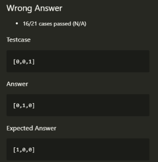

# Error

## 错误提示：load of null pointer of type 'const int'

在调用函数时，如果返回值如果是一个常量则没问题；
如果返回值若为指针则可能会出现该错误，假如返回的指针地址指向函数内的局部变量，在函数退出时，该变量的存储空间会被销毁，此时去访问该地址就会出现这个错误。

解决办法有以下三种:

1. 返回的指针使用 malloc 分配空间（推荐）
2. 将该变量使用 static 修饰 static 修饰的内部变量作用域不变 但是声明周期延长到程序结束 即该变量在函数退出后仍然存在；
3. 使用全局变量（不推荐）

```C
/**
 * Note: The returned array must be malloced, assume caller calls free().
 * 不看题目注释，吃亏在眼前！
 */
int* twoSum(int* nums, int numsSize, int target, int* returnSize){
    int *answer = (int *)malloc(sizeof(int) * 2);
    for(int i = 0; i < numsSize - 1; i++) {
        for(int j = i+1; j < numsSize; j++) {
            if(nums[i]+nums[j] == target) {
                answer[0] = i;
                answer[1] = j;
                *returnSize = 2;
                return answer;
            }
        }
    }
    return answer;
}
```

# Write Up

## 283.移动零.c

思路1

// 1. for, if zero, move

```cpp
void moveZeroes(int* nujs, int numsSize) {
    for(int i = 0; i < numsSize; i++) {
        if(nums[i] == 0) {
            for(int j = i; j < numsSize-1; j++) {
                nums[j] = nums[j+1]；
            }
            nums[numsSize-1] = 0;
        }
    }
}
```

Submit 遇到问题：



<font color="yellow">反思</font>：在脑海里动态地考虑这个问题

如果改成：

```cpp
void moveZeroes(int* nujs, int numsSize) {
    for(int i = 0; i < numsSize; i++) {
        if(nums[i] == 0) {
            for(int j = i; j < numsSize-1; j++) {
                nums[j] = nums[j+1]；
            }
            nums[numsSize-1] = 0;
+           i--;
        }
    }
}
```

遇到连续的 0 就会将进入死循环。

// 不要抢救！换思路！

```cpp
void moveZeroes(int* nums, int numsSize) {
    int num_0 = 0;
    for(int i = 0; i < numsSize; i++) {
        if(nums[i] == 0) {
            num_0++;
        }
    }
    for(int i = 0; i < numsSize; i++) {
        if(num_0 == 0)
            break;
        if(nums[i] == 0) {
            for(int j = i; j < numsSize - 1; j++) {
                nums[j] = nums[j+1];
            }
            i--;
            nums[numsSize-1]=0;
            num_0 --;
        }
    }
}
```

